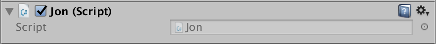
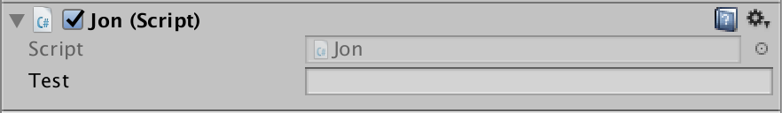

# C#の基礎
ここではUnityで使うC#を主に扱います。

## ファイルの拡張子
ファイルの拡張子は「.cs」です。

## コメントの記述
コメントはSwiftと同じ書き方をします
```c
  
  // 一行のコメント

```
```c
  
  /*
   * 複数行のコメント
   */
```
コメントは積極的に残しましょう.
## 基本的な構造
UnityのC#の構造です。普通のC#はこのようにはなっていないのでUnity独自だと思ってください.
```c
  // ライブラリやフレームワークを使う宣言.
  using UnityEngine;
  using System.Collections;

  public class Jon : MonoBehaviour {  // クラスの名前.

    void Start () {   // 最初に一度だけ呼ばれる関数.
    
    }
    void Update () {  // フレームのアップデートごとに呼ばれる関数.
    
    }

  }

```

## 変数の宣言
C#の変数宣言には変数の型を指定する必要があります.
```c
  // 変数型 変数名;
  int x = 100;
  int y = 100;
  string message = "あいうえお";

```
### public
今まではpublicにすることで他のコードからも参照できる、というような覚え方をしていたと思いますが、Unityにおけるpublicは**UnityのInspecter側からもアクセスできる**という意味を持ちます.  
例えば、普段のscriptを当てたInspecterはこうなっていますが  
  
コード側でこのようにpublicの変数を作ってみます.
```c
  public string test; 
```
するとInspecterから変数の内部に値を入れられるようになります.  
  
この機能はよく利用するので覚えておきましょう.

### new演算子
C#では変数を初期化するためにnew演算子を使います.使い方は、Swiftなどのクラスの初期化の前にnewをつけるだけです.つけ忘れるとエラーになるので注意しましょう.  

### 特殊な変数型
他にも今まではあまり馴染みがなかった型でもゲームを作る上ではよく使う型が幾つかあります。
#### GameObject
UnityではScene上に配置されるものをGameObjectとして扱います.
```c 
```
#### Vector2
2次元のベクトルを扱うクラスです.内部にx,yを値を保持することができます.
```c
  Vector2 vector = new Vector2 ();
  vector.x = 100;
  vector.y = 100; 
```
#### Vector3
3次元のベクトルを扱うクラスです.内部にx,y,zを値を保持することができます.
```c 
  Vector3 vector = new Vector3 ();
  vector.x = 100;
  vector.y = 100; 
  vector.z = 100; 
```
#### Sprite
spriteは画像や図形を表す英単語です. プログラミングでは主に画像データのことを指します. このspriteは主にpublicにして外部から参照させることが多いかと思いますが、プログラム側からAssetsにアクセスして取ってくる場合もあると思います.
```c 
  Sprite sprite;
```
#### Time
Timeはゲームが始まってからの時間を管理していてくれるクラスです.
```c 
  
  Time time = Time.time;  // ゲームを開始してからの秒数.
  Time frame = Time.frameCount; // ゲームを開始してからのフレーム数.

```
### Texture2D

