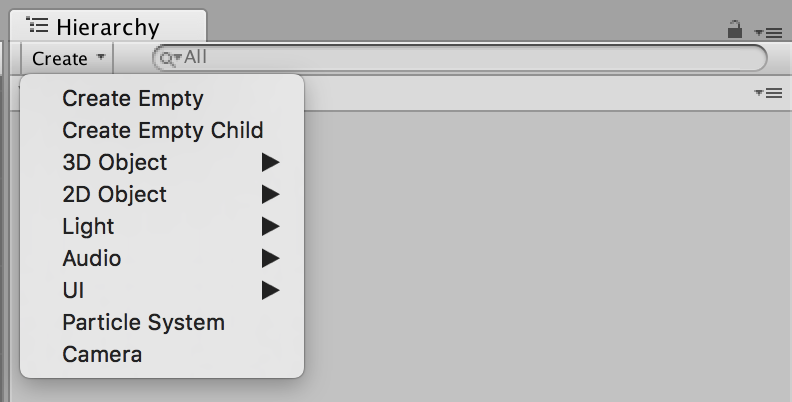
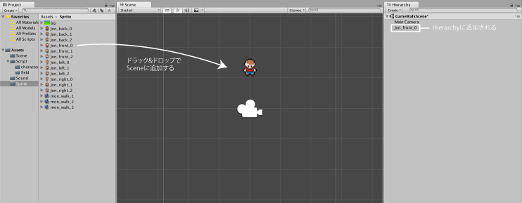

# ゲームオブジェクトを配置する
## ゲームオブジェクトを作る
ゲームオブジェクトは**Hierarchy > Create**をクリックすることで作ることができます. GameObjectには様々な種類があります.
  
GameObjectは種類によって初期のComponentなどが違います.

## Spriteを配置する
すでにAssetsに登録してあるものであれば、Assetsからドラッグ&ドロップでSceneに追加することができます。Sceneに置かれるとHierarchyに追加されます。このHierarchyからさらにInspectorでComponentを処理することが可能になります.  

  

この時、Assetsにある追加したSpriteと、HierarchyにあるSpriteはすでに別ものになっているます.(Hierarchy上にあるものはGameObject化されている) なので、Hierarchyの方のObjectの名前を変えても、Assets側も変更される、などということはありません.  