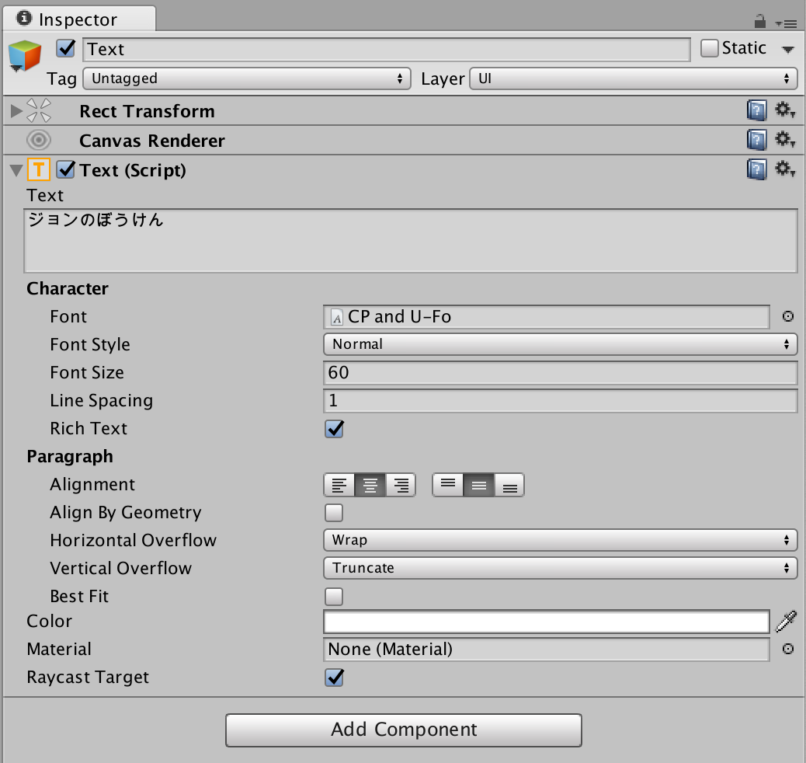
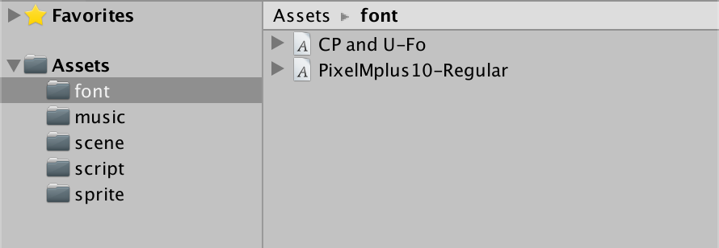
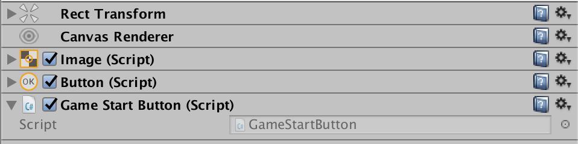
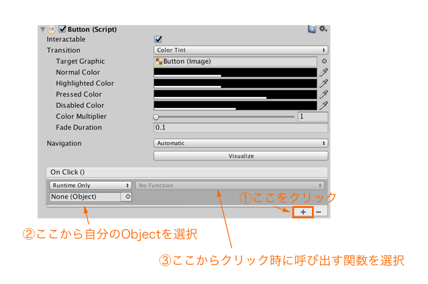
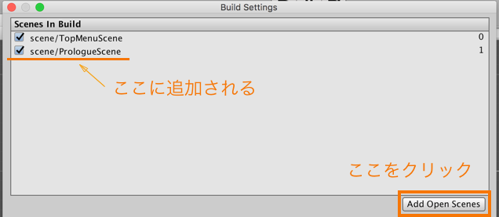

# スタート画面を作ってみる
## 背景
背景を置きます. Assetsに追加したbg画像を使ってみます. Sceneにドラッグ&ドロップしてみましょう.
## タイトル
**Hierarchy > Create > UI > Text**を選択するとTextがHierarchyに追加されます. 見えない場合は、x,yを0にしてみると真ん中に移動してくるはずです.

### フォントの調整
頑張っていじってそれっぽくします. いじれるプロパティは以下のようなものがあります.


### フォントの読み込み
FontBookから自分の使いたいFontを選んでFolderに表示させます. これをドラッグ&ドロップしてAssetの中に入れます.  



あとはtext側でfontの横の小さい天をクリックすればwindowが出ます. そこに表示されているはずです.

## スタートボタンをつける
### ボタンを配置する
**Hierarchy > Create > UI > Button**を選択するとButtonがHierarchyに追加されます. 
### ボタンをクリックした時の動作をつける
#### scriptを作る
ボタン用に新しいscriptを作ります.  
**Assets > Create > C# Script**  
わかりやすい名前のファイルにしてあげましょう.

#### ボタンにスクリプトをつける
作ったscriptをボタンにドラッグ&ドロップします. ボタンのComponentの一番下に作ったscriptがアタッチされていることが確認できればokです


#### ボタンのクリックにscriptを紐付ける
今の状態だと、ボタン側はクリックした時にどの関数を呼び出せばいいのかわからない状態です。そのため、教えてあげる必要があります. 手順としては,  

  1. ボタンの「On Click ()」の右下の+を押す.
  2. NoneになっているObjectに自分のObjectを当てる.
  3. Nofunctionのところに作ったClick用の関数を当てる.



## 画面を遷移させる
#### Sceneを追加する
** Assets > Create > Scene ** で新しいSceneを追加します. Sceneファイルをダブルクリックで新しいSceneを開くことができます.
BuildSettingにも追加しておきます.  
  

### Sceneを遷移させる
scriptを書きます.  
まず、SceneManagerを使えるように読み込みましょう.
```c 
  using UnityEngine.SceneManagement;
```
あとはSceneを切り替えるタイミングで``SceneManager.LoadScene``を呼べばいいだけです.(NextSceneには自分でつけたSceneファイルの名前をつけましょう.)

```c 
  SceneManager.LoadScene ("NextScene");
```