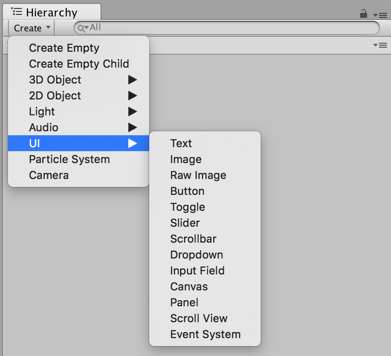

# UIパーツを配置する
ボタンやTextなどのUIパーツも作ることができます. UIパーツもHierarchyのCreateから作ります.

UIパーツはCanvasという特殊は配置になるのでGame(Preview)を見ながら位置を調整します.

## 画面のサイズによって大きさを調整させるようにする(mobile)
mobileでは端末によって解像度が大きく違うので、表示の大きさも変わってしまいます。できるだけ同じに見えるようにしてくれるシステムがUnityにはあります.

## Buttonの挙動を追加する.
ボタンをクリックした時の動作を付け加えます. 手順が特殊ですが、覚えると他のことにも応用できる方法なので頑張って覚えましょう-.

### ButtonのScriptを生成する

### ButtonにScriptを当てる

### Click時用の関数を作る

### Clickのタイミングに関数が呼ばれるようにする

##