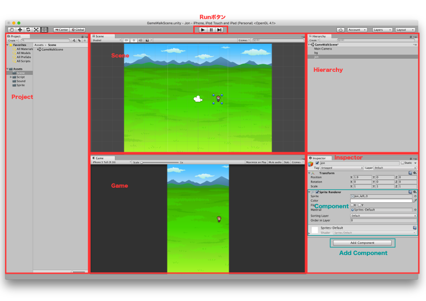
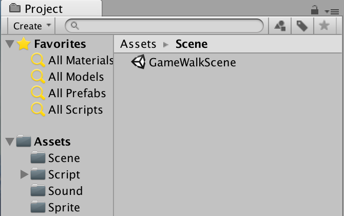
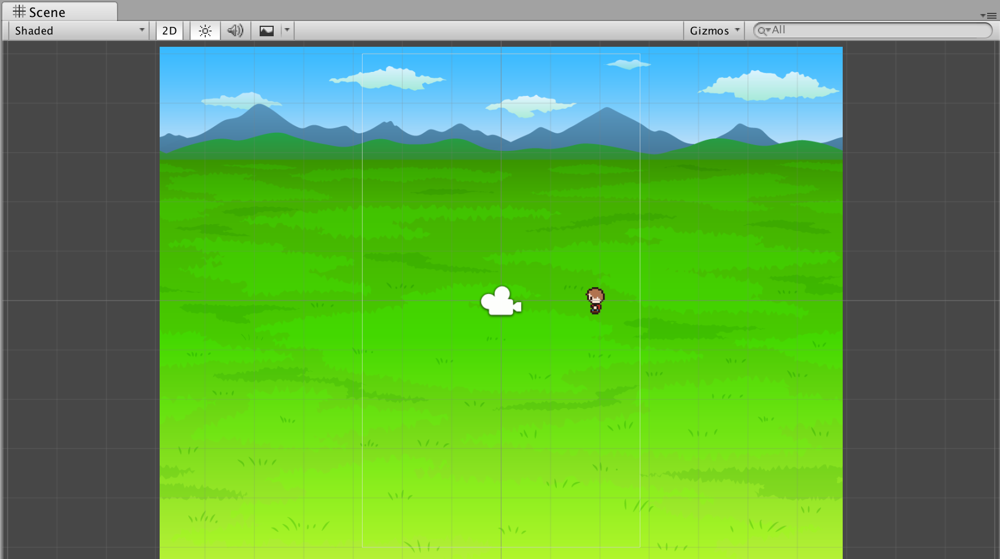
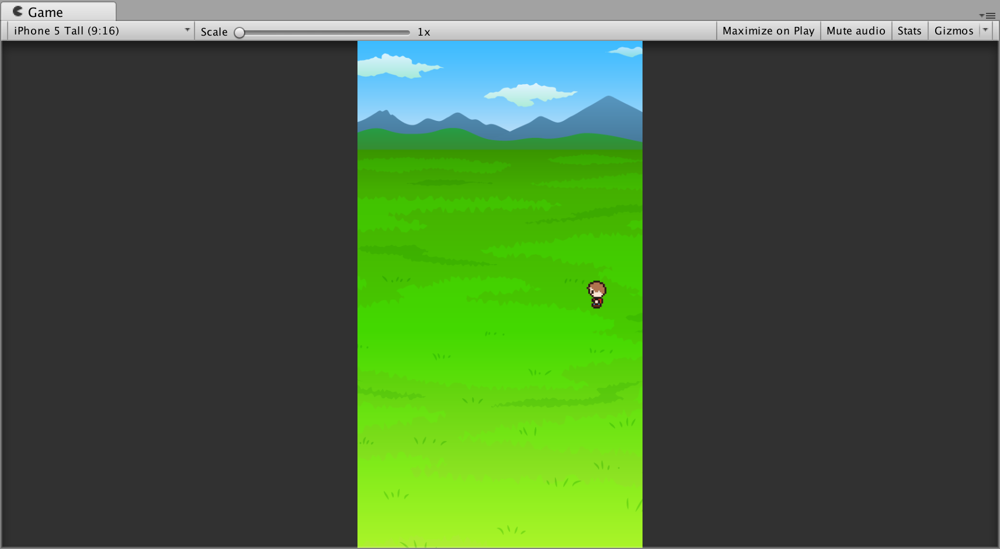
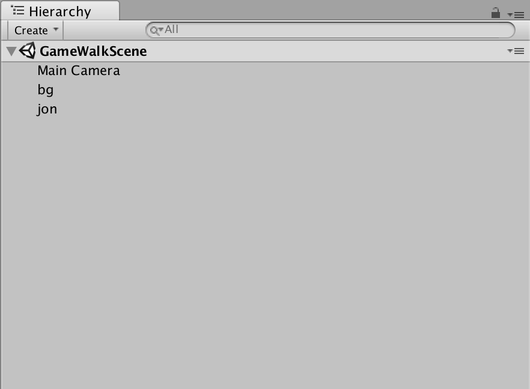
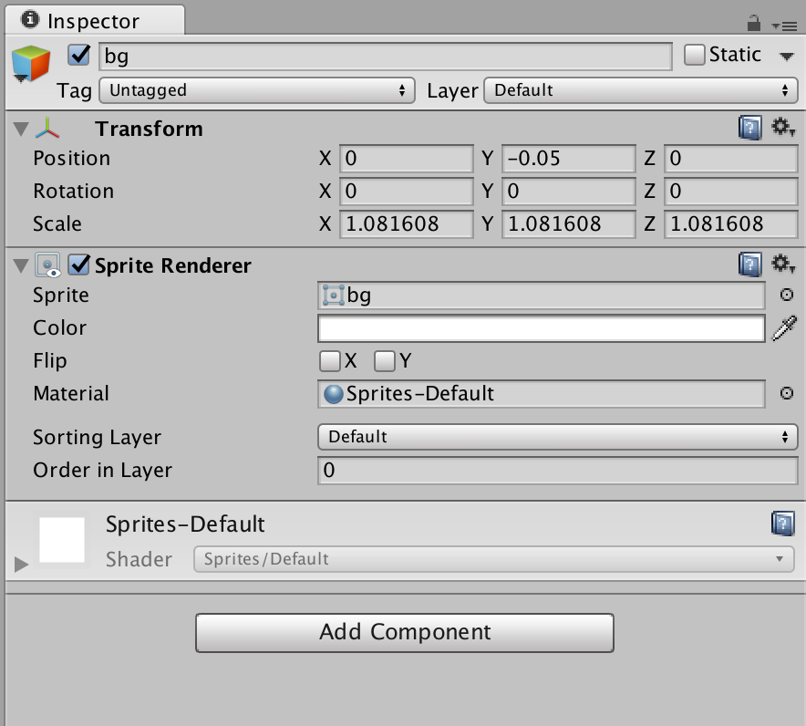
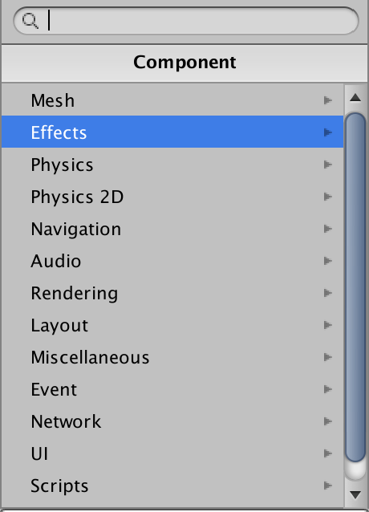

# Unityの基礎
## 環境構築
Unityは無料バージョンで大体のことはできます.[ここらへん](https://unity3d.com/jp/get-unity/update)から落としましょう.

## ドキュメント
Unityは[ドキュメント](https://docs.unity3d.com/ja/current/Manual/UnityManual.html)で色々なゲームの作り方を解説してくれています. 自分の作りたいものが決まったら一通り見ておくと良いです.(最初は多分理解できないと思いますが、理解することよりも読んだり実行してみることが大切.)

## 画面の見方
画面は幾つかの機能に分かれています.人によって機能の位置が違うので判りやすいように配置し直すと便利です.  

### Project
ProjectにはSceneやScriptのファイル、画像のファイルなど、ゲームを作る上で必要な道具を入れておくAssetsを管理しています.Assetsにはもともとフォルダはありませんが、分けておくと見やすくて便利です.  

### Scene

### Game
実際にゲームした時のイメージをつかむことができるPreviewです。

### Hierarchy

### Inspecter
InspecterにはHierarchyやProjectで選んだものの詳細のプロパティが表示されています。  
  

InspecterではオブジェクトにComponentをつけたすことができます.Componentにはいろいろな種類があります. 
  
[Compornent](https://docs.unity3d.com/ja/current/Manual/UsingComponents.html)はオブジェクトやゲームでの振る舞いに関する心臓部です。(リンクより引用)つまり、Compornentを付け加えることによってどんな見た目になるか、どんな大きさで、どんな位置に配置されるか、どんな動きをするか、どんな音を付随するのか、など決められます. どんなものがあるかは[ここ](http://dev.classmethod.jp/client-side/unity-client-side/unity4-6-ui-components-property-list/)とかで見ることができます.(4.6なのでちょっと古いバージョンですが、知識としては使えます.)

  **Transform**  
    初期の状態で付けられているCompornent.ゲームオブジェクトの大きさや位置などをしていするCompornent.  

  **[Mesh](https://docs.unity3d.com/ja/current/Manual/comp-MeshGroup.html)**  
    3Dをレンダリングするためのメッシュを管理します.

  **[Effect](https://docs.unity3d.com/jp/current/Manual/comp-UIEffects.html)**  
    Text や Image グラフィックに対して影や輪郭といったシンプルなエフェクトを付加することができます。

  **Physics**  
  **Physics 2D**  
    物理演算を行わせるためのCompornent. 重力を付け加えたりできます.

  **Navigation**  
  
  **Audio**  
    サウンドを鳴らすためのCompornentです.

  **[Rendering](https://docs.unity3d.com/ja/current/Manual/comp-RenderingGroup.html)**  

  **[Layout](https://docs.unity3d.com/ja/current/Manual/script-LayoutElement.html**  
    レイアウトに関する設定を行うことができるCompornentです.

  **Miscellaneous**  
  **Event**  
  **Network**  
  **UI**  
  **Script**

## 2D/3D

